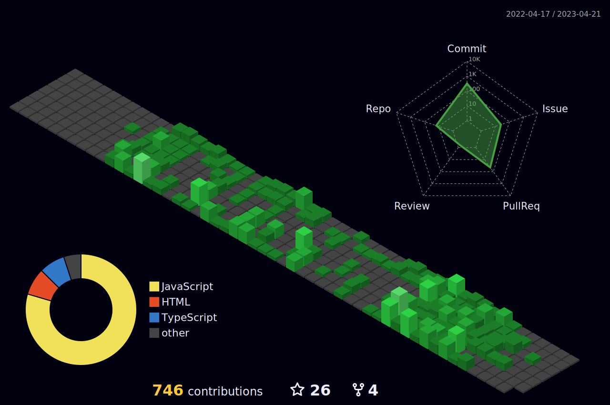

  

<h1 align="center">Hi  I'm Akash Kumar Singh </h1>
<h4 align="center">I'm a Passionate and Dedicated Full Stack Web developer skilled in MERN Stack ✨.</h4>

🌍 I'm from Varanasi, UttarPradesh

⚛️ Some technologies that I love to work includes MERN stack, Typescript & Web Testing.

🚀 I have learned couple of CSS libraries like Chakra UI & styled-components.

📧 Email - akashviratsingh018@gmail.com

💼 Portfolio - [https://itsakash12.github.io/]
## 🌐 Socials

# 💻 Tech Stack
 
 
 
 
 
 
 
 
 

 
 
 
 

   
  

  

  

